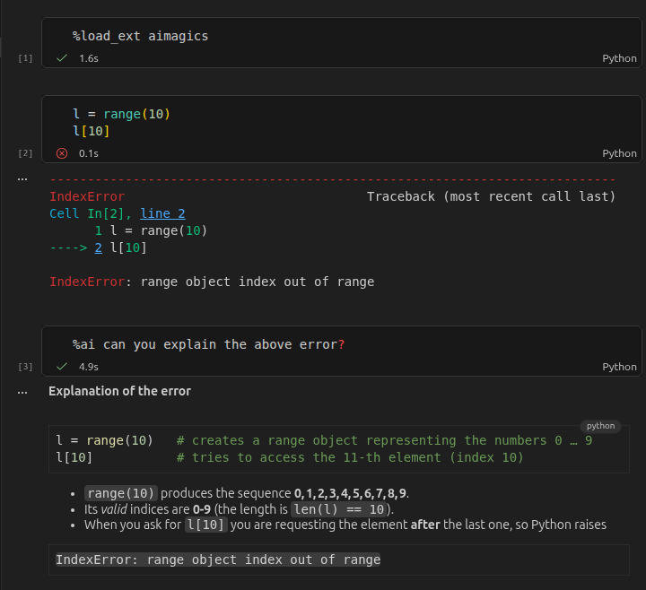

# aimagics


<!-- WARNING: THIS FILE WAS AUTOGENERATED! DO NOT EDIT! -->



## Installation

This package can be installed with pip via

``` sh
$ pip install aimagics
```

## Setup

### 1. Load the package

After installation, you can load the package in Jupyter and ipython with

``` python
%load_ext aimagics
```

Whether the package has been loaded can be checked with

``` python
from IPython import get_ipython
get_ipython().extension_manager.loaded
```

    {'IPython.extensions.storemagic', 'aimagics'}

‘aimagics’ should appear in the output.

### 2. Set LLM API key

You should set your environment API key to your favorite LLM provider.
The default model is

``` python
AIMagics().model
```

    'openrouter/openai/gpt-oss-120b'

so the environment key needed is `OPENROUTER_API_KEY`.

All [LiteLLM](https://models.litellm.ai/) models are compatible.

### 3. Turn auto save on

The package works by retrieving the current notebook from disk. To
always get the current state, it is recommended to turn auto save on.
This is the default in jupyter notebooks, and can be toggled in vscode
via `Show and Run Commands` \> `File: Toggle Auto Save`.

## Usage

The package exposes two commands: `%ai` and `%%ai`. These are so-called
‘line’ and ‘cell magics’ and can be used as follows:

### Line magic

The command `%ai` processes what comes after on the same line as request
to the LLM:

``` python
%ai What is aimagics?
```

**`aimagics`** is a Python package and IPython extension that brings
Large Language Model (LLM) capabilities directly into Jupyter notebooks
via magic commands.

### Key Features:

- **Magic Commands**: Offers `%ai` (line magic) and `%%ai` (cell magic)
  to interact with models directly within code cells.
- **Context-Aware**: Reads the current notebook state from disk to
  provide context-aware responses to your code and markdown.
- **Broad Model Support**: Built on
  [LiteLLM](https://models.litellm.ai/), allowing you to connect to
  OpenRouter, OpenAI, Anthropic, and dozens of other LLM providers.

### Cell magic

The command `%%ai` processes what comes after it on the same line, but
also what is in the same cell below it:

<!-- Sorry this is hard-coded because of some issues with getting the output of %%ai in nbdev. 
The code ran as expected, see hidden cell below-->

``` python
%%ai Why does the following code fail?
1/0
```

**Answer**

``` python
1/0
```

fails because it raises a **`ZeroDivisionError`**. In Python (and
mathematics), division by zero is undefined, so attempting to compute
`1 / 0` triggers this exception:

    ZeroDivisionError: division by zero

To avoid the error, ensure the denominator is never zero, e.g.:

``` python
denominator = 2  # any non‑zero value
result = 1 / denominator
```

By default, the entire notebook up to and including the calling cell is
included in the prompt as context.

## Configuration

The possible configuration options can be viewed with

``` python
%config AIMagics
```

    AIMagics(Magics) options
    ----------------------
    AIMagics.model=<Unicode>
        Provider/model to be used.
        Current: 'openrouter/openai/gpt-oss-120b'
    AIMagics.system_prompt=<Unicode>
        The system prompt prepended to any prompt and context.
        Current: "You are a helpful assistant living inside a user's Jupyter notebook. \n        Use markdown syntax for styling your responses.\n        Keep your responses brief and to the point.\n"

For example, you can change the model with

``` python
%config AIMagics.model = "openrouter/google/gemini-3.8-flash"
```

``` python
%ai what model are you?
```

I am **Gemini** (specifically configured as
`openrouter/google/gemini-3.8-flash`), a large language model trained by
Google.

### Documentation

Documentation can be found hosted on this GitHub
[repository](https://github.com/adrische/aimagics)’s
[pages](https://adrische.github.io/aimagics/). Additionally you can find
package manager specific guidelines on
[conda](https://anaconda.org/adrische/aimagics) and
[pypi](https://pypi.org/project/aimagics/) respectively.

## Acknowledgements

This repository would not be possible without the FastAI / AnswerAI open
source packages, in particular
[FastLLM](https://github.com/AnswerDotAI/fastllm). AnswerAI even have a
dedicated platform for notebooks with AI integration:
[SolveIt](https://solve.it.com/).

There are a number of packages implementing basically the same ideas
(just much better):

- [AnswerDotAI/ai-jup](https://github.com/AnswerDotAI/ai-jup) An
  extension for Jupyter Lab
- [AnswerDotAI/ipyai](https://github.com/AnswerDotAI/ipyai) An extension
  of IPython in the terminal
- <https://nathancooper.io/blog/2026-08-10-ipython-is-all-you-need> An
  excellent blog post implementing these ideas much better for ipython.

During the finishing stages I also found
<https://pypi.org/project/aimagic/> on PyPi, which is also a package by
AnswerAI and basically what I am implementing here, even with the same
syntax and the same name, just for Jupyter (relying on Javascript to get
the cells for context).
